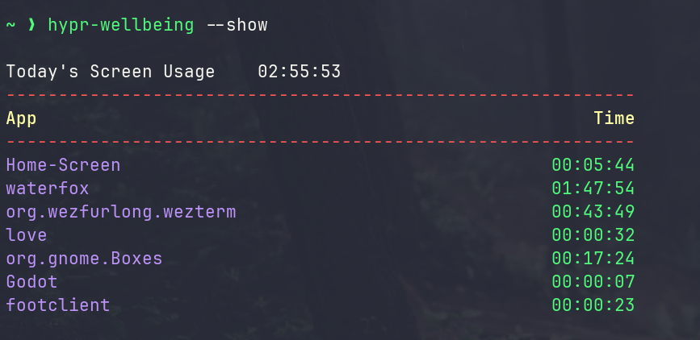

# hypr-wellbeing



## Installation

### AUR

```sh
paru -S hypr-wellbeing-bin
```

### Nix Flakes
Add to your flake inputs:
```nix
inputs.hypr-wellbeing.url = "github:DemonKingSwarn/hypr-wellbeing";
```

Then add to your packages:
```nix
environment.systemPackages = [ inputs.hypr-wellbeing.packages.${pkgs.system}.default ];
# or with home-manager:
home.packages = [ inputs.hypr-wellbeing.packages.${pkgs.system}.default ];
```

### Github Releases

You can download it from [Releases](https://github.com/DemonKingSwarn/hypr-wellbeing/releases)

### Configuration

It is located in `~/.config/hypr-wellbeing/config.json`

## Usage

### Monitor Mode

**Linux**:

```sh
hypr-wellbeing -d &> /dev/null &
```
### Show Stats

```sh
hypr-wellbeing --show
```

### Show Weekly Stats

```sh
hypr-wellbeing --weekly
```

## To-Do 

- [] Monthly view

## Special Thanks

- [Watcher](https://github.com/Waishnav/Watcher) (Similar to hyprwatch but only for X11) - for showing how to calculate the timings of the app
