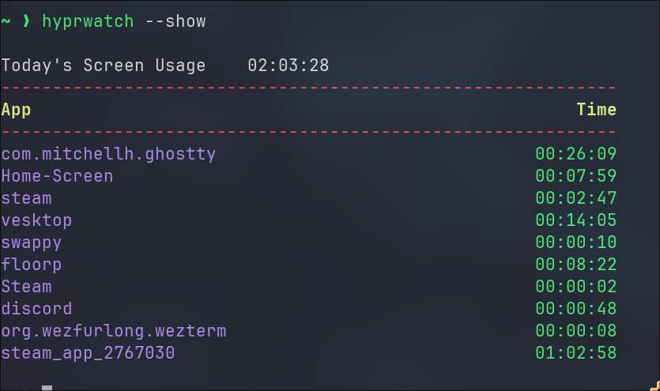

# hypr-wellbeing



## Usage

> [!NOTE]
> make sure you ran this command before running the program

```sh
mkdir -p $HOME/.cache/hyprwatch/daily_data
```

### Monitor Mode

```sh
hyprwatch -d &> /dev/null &
```

### Show Stats

```sh
hyprwatch --show
```

## To-Do 

- [] Weekly view
- [] Monthly view

## Special Thanks

- [Watcher](https://github.com/Waishnav/Watcher) (Similar to hyprwatch but only for X11) - for showing how to calculate the timings of the app
